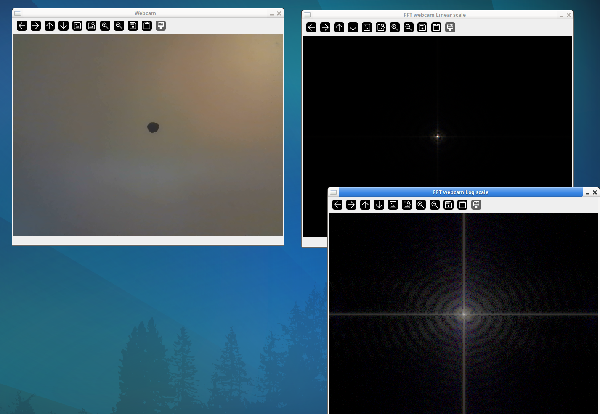
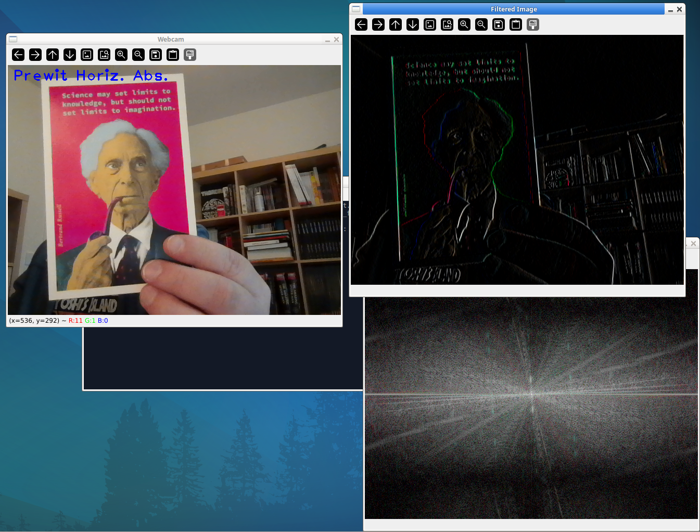
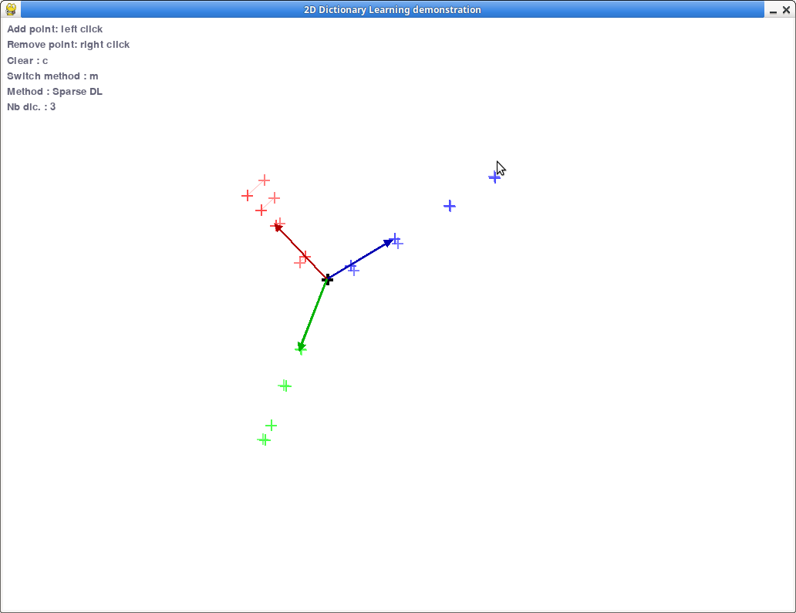

PYTHON Demos
============

This repository contains several python3 scripts demonstrations. They all have
MIT license.

# How to run

All scripts from the demos are available in the `demos` folder. 

One can run easily all demos using the `demo.py` script in the root folder. 

The list of available demos is given by:
```bash
python3 demo.py -l
```

To run the demo you can execute:
```bash
python3 demo.py [demo_name]
```

To print the list of dependencies for a given demo you can run:
```bash
python3 demo.py -d [demo_name]
```
you can store it in a text file and install it with pip.

# Demos

## Total Variation on webcam

In this demonstration we perform online Total Variation regularization on the
video captured on the webcam. 

Screenshot:


Shortcuts:

* <kbd>q</kbd> : Quit demo
* <kbd>s</kbd> : Save screen to png
* <kbd>s</kbd> : Save screen to png
* <kbd>Space</kbd> : Do full image TV
* <kbd>h</kbd> : Do half image TV (screenshot)
* <kbd>+</kbd> : Make TV regularization stronger
* <kbd>-</kbd> : Make TV regularization weaker
* <kbd>n</kbd> : Add salt and pepper noise
* <kbd>b</kbd> : Make noise more aggressive
* <kbd>,</kbd> : Make noise less aggressive

Dependencies:

This demo uses [opencv-python](https://github.com/skvark/opencv-python) for
webcam access and visualization and [prox_tv](https://github.com/albarji/proxTV) for total variation proximal
operator. 

## Real time audio spectrum

In this demonstration we plot in real time the audio spectrum (and the time
frequency analysis) of the microphone.


Shortcuts:

* <kbd>q</kbd> or <kbd>Esc</kbd>  : Quit demo
* <kbd>Space</kbd>  : Pause/unpause demo
* <kbd>r</kbd>  : Reset time
* <kbd>+</kbd> or <kbd>N</kbd> : Multiply nfft by 2 (zoom in to lower frequencies)
* <kbd>-</kbd> or <kbd>n</kbd>  : Divide nfft by 2 (zoom out)
* <kbd>W</kbd> : Multiply time window size by 2
* <kbd>w</kbd> : Divide time window size by 2
* <kbd>P</kbd>/<kbd>p</kbd> : Change scale of power spectrum (up/down)
* <kbd>S</kbd>/<kbd>s</kbd> : Change scale of power spectrum (up/down)

Dependencies:

This demo uses [pygame](https://www.pygame.org/) for visualization and
[PyAudio](http://people.csail.mit.edu/hubert/pyaudio/) for microphone recording. 

## Real time 2D FFT of webcam

In this demonstration we perform online 2D fft of a webcam input. Both the
absolute value and the log of the absolute values are displayed and the 0
frequency is centered on the window (fftshift).

Screenshot:



Shortcuts:

* <kbd>q</kbd> : Quit demo
* <kbd>s</kbd> : Save screen to png
* <kbd>Space</kbd> : Pause FFT
* <kbd>w</kbd> : Active or deactivate windowing


Dependencies:

This demo uses [opencv-python](https://github.com/skvark/opencv-python) for
webcam access and visualization.


## Real time 2D filtering of webcam

In this demonstration we perform online 2D filtering of a webcam input. Both the
original, filtered and FFT of the filtered video with 0
frequency centered on the window (fftshift) are displayed.

Screenshot:



Shortcuts:

* <kbd>q</kbd> : Quit demo
* <kbd>s</kbd> : Save screen to png
* <kbd>Space</kbd> : Apply/deactivate filter
* <kbd>f</kbd> : Change filter (average, high pass, Prewitt, Sobel, median, ...)
* <kbd>+</kbd> <kbd>-</kbd> : Change cutoff frequency of filter (or its size)
* <kbd>w</kbd> : Active or deactivate windowing

Dependencies:

This demo uses [opencv-python](https://github.com/skvark/opencv-python) for
webcam access and visualization.

## 2D classification demo

In this demonstration we illustrate the decision function and update of 2D
classifiers when adding training samples from negative or positive classes. We
provide decision functions for Linear and Gaussian Kernel SVMs.


* <kbd>q</kbd> : Quit demo
* <kbd>left click</kbd> : Add samples from red class
* <kbd>right click</kbd> : Add samples from blue class
* <kbd>c</kbd> : Clear training data
* <kbd>Space</kbd> : Show/hide decision function
* <kbd>m</kbd> : Change classifier (Linear/Gaussian SVM)
* <kbd>Up</kbd> : Make Gaussian Gamma parameter larger
* <kbd>Down</kbd> : Make Gaussian Gamma parameter smaller
* <kbd>s</kbd> : save screenshot

Dependencies:

This demo uses [pygame](https://www.pygame.org/) for visualization and
[Scikit-learn](https://scikit-learn.org/) for classification.

## 2D Dictionary learning demo

In this demonstration we illustrate dictionary learning on 2D data. The user cla
click on the window to add samples (left click) and to remove samples (right
click). The dictionary is learned in real time and the atoms are displayed.




* <kbd>q</kbd> : Quit demo
* <kbd>left click</kbd> : Add sample
* <kbd>right click</kbd> : Remove sample
* <kbd>c</kbd> : Clear training data
* <kbd>Space</kbd> : Show/hide dictionary atoms and color samples wrt their representation
* <kbd>m</kbd> : Change method (PCA, ICA KMeans, NMF, SparsePCA, DictionaryLearning)
* <kbd>p</kbd> : Show projected and reconstructed samples
* <kbd>Up</kbd> : Increment the number of atoms
* <kbd>Down</kbd> : Decrement the number of atoms
* <kbd>s</kbd> : save screenshot

Dependencies:

This demo uses [pygame](https://www.pygame.org/) for visualization and
[Scikit-learn](https://scikit-learn.org/) for classification.


## Style Transfer Demo

In this demonstration we illustrate style transfer on image taken from the
webcam. You can choose among several styles.

The implementation for style transfer has been shamelessly copied from
[Pytorch_WCT](https://github.com/irasin/Pytorch_WCT) that is an implementation
of the paper [Universal Style Transfer via Feature Transforms](https://arxiv.org/pdf/1705.08086.pdf). 

Computational time for transfer takes a few seconds on a laptop with no GPU and  freeze the windows.


* <kbd>q</kbd> : Quit demo
* <kbd>p</kbd> : Take picture/unfreeze webcam
* <kbd>s</kbd> : Switch target style
* <kbd>Space</kbd> : Apply selected style 
* <kbd>w</kbd> : Save images to disk (folder out/)
* <kbd>r</kbd> : Run transfer for all styles and save to file (takes forever)

Dependencies:

This demo uses [opencv-python](https://github.com/skvark/opencv-python) for
webcam access and visualization and [torch/torchvision](https://pytorch.org/) as deep learning
framework.

## Discrete Optimal Transport demo

In this demonstration we plot in real time the solution of optimal transport (OT)
between discrete distributions. The samples from source can be added by a left
clock and samples from target distribution can be added by a right click.


Shortcuts:

* <kbd>q</kbd> or <kbd>Esc</kbd>  : Quit demo
* <kbd>Space</kbd>  : Show/Hide the optimal transport matrix
* <kbd>c</kbd>  : Clear all samples
* <kbd>r</kbd> : Activate/deactivate entropic regularization
* <kbd>p</kbd> or <kbd>m</kbd> : Increase or decrease regularization parameter
* <kbd>t</kbd> : Rotate the target distribution
* <kbd>e</kbd> : remove some samples so that they have equal number
* <kbd>d</kbd> : change the metric in OT loss

Dependencies:

This demo uses [pygame](https://www.pygame.org/) for visualization and
[POT](https://github.com/PythonOT/POT) for computing the solution of
the OT problem. 

## Face detection

In this demo we use a Haar Cascade Classifier to detect faces and show the areas where a face was detected. We use the default face classifier from OpenCV that detect only frontal faces.


* <kbd>q</kbd> : Quit demo
* <kbd>s</kbd> : Save screenshot


This demo uses [opencv-python](https://github.com/skvark/opencv-python) for
webcam access and visualization.


# Installing dependencies

There is an important number of dependencies to run all the demos. Each script
has its own dependencies. 
To print the list of dependencies for a given demo you can run:
```bash
python3 demo.py -d [demo_name]
```

 


